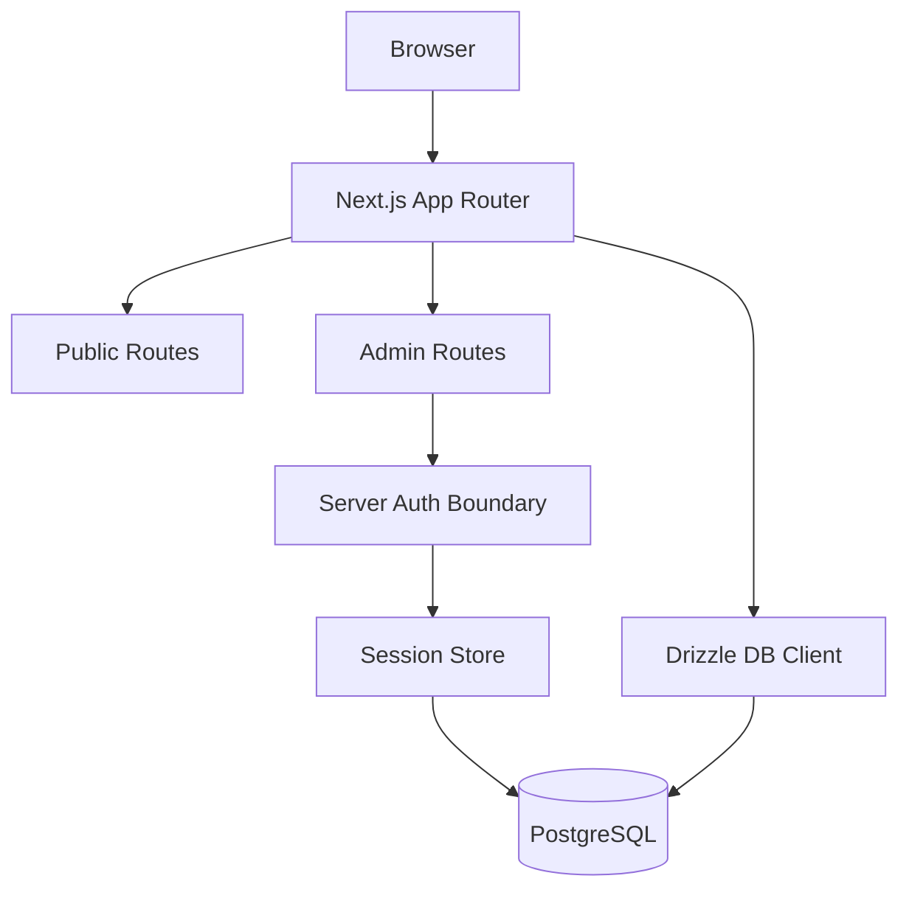
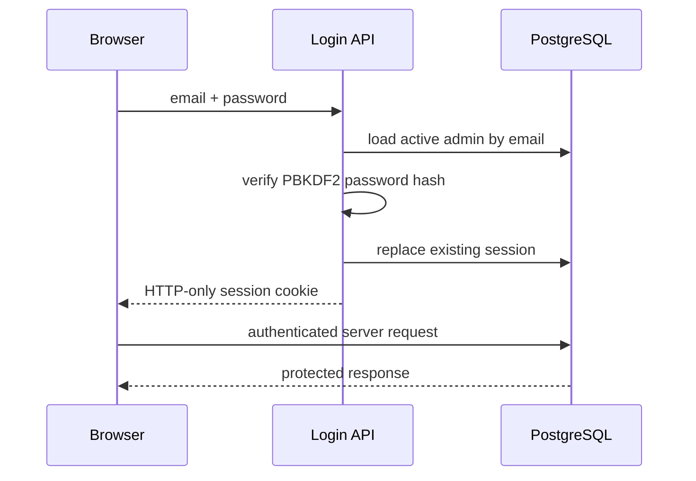

# Architecture — Phase 3 Authentication

## Product boundary

The portfolio remains a modular Next.js application. Phase 3 adds a server-enforced private administration boundary without introducing a separate authentication service.

## Current runtime

## Authentication flow

The browser never receives the stored password hash or raw session token through application data. The database stores only a hash of the opaque session token.

## Protected route contract

Server-side administrative code calls `requireAdminSession()` before privileged operations. Authentication is therefore an application/server concern rather than a client-side visibility check.

## Phase boundaries

Phase 3 intentionally does not implement content CRUD, revisions, audit trails, analytics, or MFA. Those are separate concerns and should build on this authentication boundary rather than bypass it.
