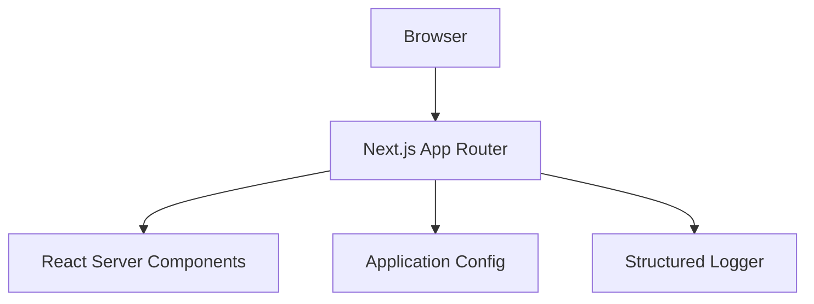
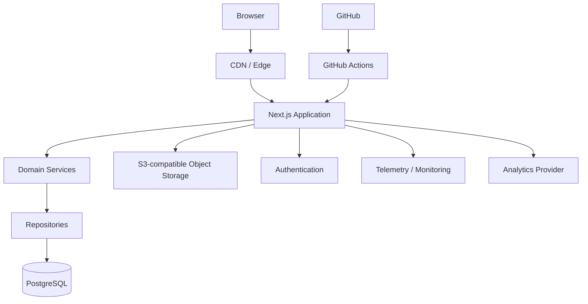

# Architecture — Phase 1 Foundation

## Product boundary

The portfolio is a modular Next.js application. It is intentionally not a microservice system. Domain, server, UI, and infrastructure boundaries are established before adding persistence or external services.

## Current runtime

## Planned runtime

## Principles

1. Server Components by default.
2. Client Components only when interaction requires them.
3. No dependency is introduced without a concrete operational purpose.
4. Public content is separated from private administration.
5. The database and CMS arrive before dynamic portfolio content.
6. Telemetry shown publicly must be real or explicitly unavailable.
7. Security boundaries are enforced server-side.
